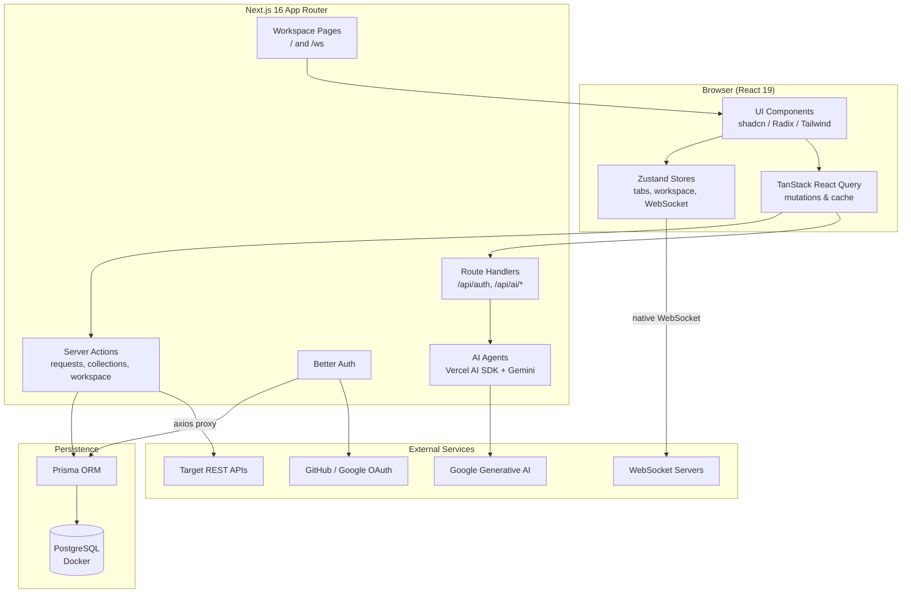
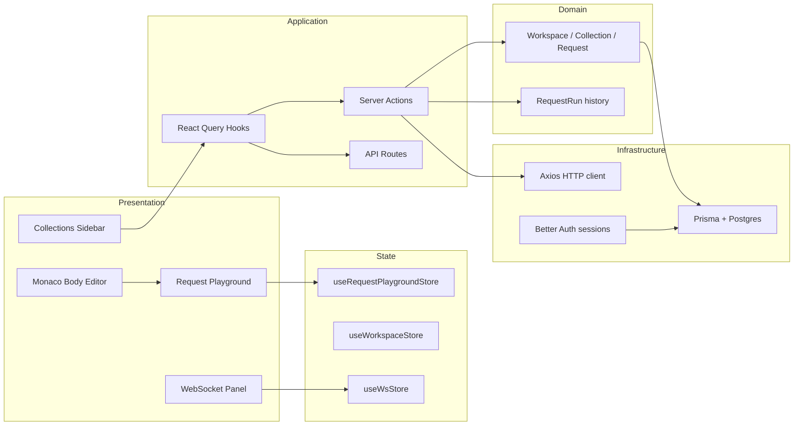
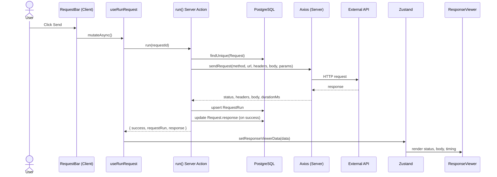
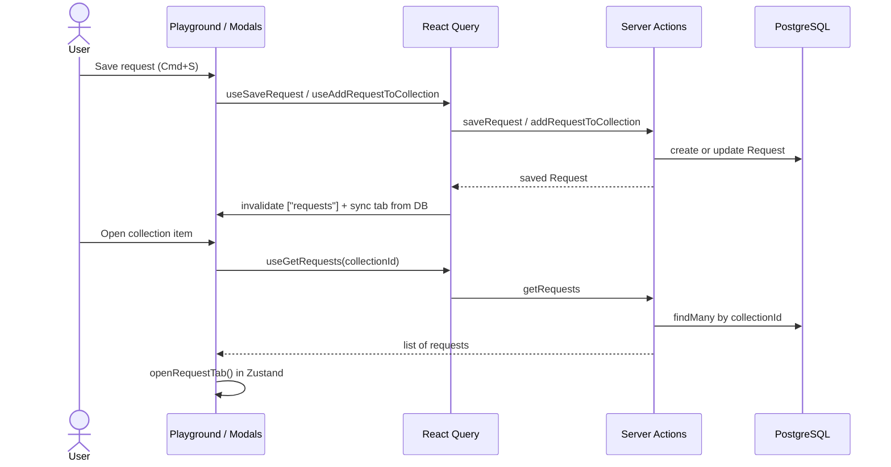
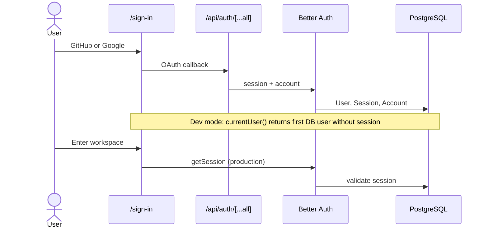
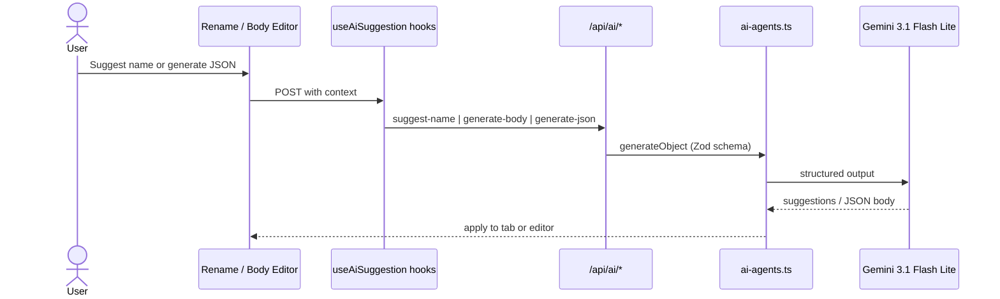
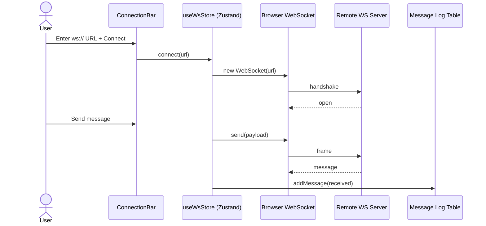
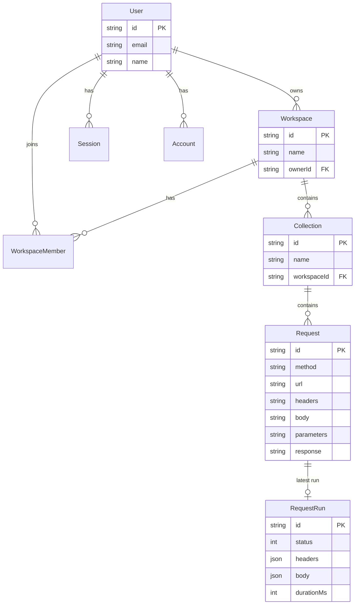

# Endpoint — Architecture & Data Flow

Endpoint is a Postman-style API client: workspaces, collections, saved HTTP requests, server-side proxy execution, response history, WebSocket testing, and AI-assisted naming and JSON body generation.

## High-Level Technical Architecture

## Layered Architecture

## HTTP Request Execution Data Flow

This is the core “Send” path: the browser never calls the target API directly; the server action proxies the call and persists the result.

## CRUD & Collection Data Flow

## Authentication Flow

## AI Assistance Data Flow

## WebSocket Testing Flow (Client-Side Only)

## Entity Relationship (Data Model)

## App Routes Map

| Route | Purpose |
|-------|---------|
| `/sign-in` | OAuth login (GitHub, Google) |
| `/` | REST playground + collections sidebar |
| `/ws` | WebSocket client tester |
| `/api/auth/[...all]` | Better Auth handler |
| `/api/ai/suggest-name` | AI request naming |
| `/api/ai/generate-body` | AI JSON body generation |
| `/api/ai/generate-json` | AI JSON utilities |
